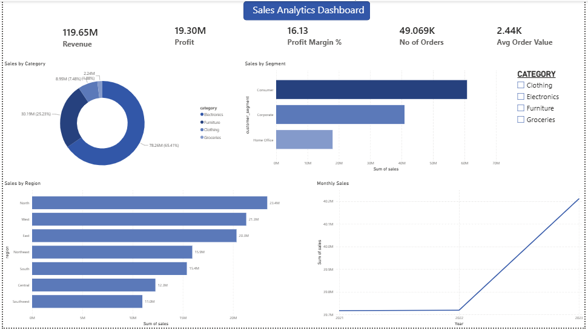

# Retail Sales Analytics Dashboard



## Project Overview
A complete end-to-end data analytics project analyzing retail sales data across 4 product categories, 7 regions, and 3 customer segments over 3 years (2021–2023). The project covers the full analyst workflow — from raw data cleaning to SQL-based analysis to an interactive business dashboard.

## Tools Used
- **Python (Pandas)** — data cleaning & validation
- **SQLite** — exploratory data analysis & KPI queries
- **Power BI** — interactive MIS dashboard for stakeholder review

## Dataset
- 50,000 rows of retail transaction data (2021–2023)
- 4 product categories: Electronics, Clothing, Furniture, Groceries
- 7 regions: North, Northeast, East, West, Central, South, Southwest
- 3 customer segments: Consumer, Corporate, Home Office
- 890 rows removed during cleaning (missing region/sales values)

## KPI Summary
| Metric | Value |
|---|---|
| Total Revenue | $119.72M |
| Total Profit | $19.31M |
| Profit Margin | 16.13% |
| Total Orders | 49,110 |
| Avg Order Value | $2,437 |

## Key Findings

### 1. Regional Revenue Leakage
South, Central, and Southwest regions generated only ~8% profit margin compared to ~20% in healthy regions (North, East, West, Northeast). These 3 regions account for ~32% of total revenue but are significantly under-monetized.

### 2. Discount Impact
Underperforming regions averaged 21–26% discounts vs 6–8% in high-performing regions. This aggressive discounting is the direct cause of the margin gap — not product mix or customer type.

### 3. Category Performance
Electronics dominates with 65% of total revenue ($78M of $119M). All 4 categories show nearly identical margins (~16%), confirming the issue is regional, not product-driven.

### 4. Customer Segments
Consumer segment drives 51% of revenue. All 3 segments show nearly identical profit margins (~16%), further confirming that discounting is a regional management problem, not a segment-level issue.

## Data Cleaning Steps
1. Loaded raw 50,000 row dataset
2. Identified 380 missing region values and 512 missing sales values
3. Removed 890 affected rows using `dropna()`
4. Converted `order_date` and `ship_date` from text to datetime format
5. Validated discount values (capped at 50%) — no outliers found
6. Validated date logic (ship date after order date) — no anomalies found
7. Saved clean 49,110 row dataset for analysis

## SQL Analysis
Queries written across 4 business areas:
- **KPI Summary** — total revenue, profit, margin, orders, avg order value
- **Regional Analysis** — performance breakdown by region, flagging underperformers
- **Revenue Leakage** — quantifying % of revenue in underperforming regions
- **Category & Segment Analysis** — sales and margin by product category and customer type

## Dashboard Features
- 5 KPI cards — Revenue, Profit, Margin %, Orders, Avg Order Value
- Interactive category slicer — filters all visuals simultaneously
- Sales by Region bar chart — visually identifies underperforming regions
- Monthly Sales Trend — 2021 to 2023 revenue growth
- Sales by Category donut chart — revenue distribution across 4 categories
- Sales by Segment bar chart — Consumer vs Corporate vs Home Office

## Project Structure
```
SALES ANALYTICS DASHBOARD/
├── sql/
│   └── analysis.sql          # KPI, regional, category, segment queries
├── analysis.py               # SQLite analysis script
├── data_cleaning.py          # Data validation & cleaning pipeline
├── retail_sales_clean.csv    # Cleaned dataset (49,110 rows)
├── retail_sales_data.csv     # Raw dataset (50,000 rows)
├── retail_dashboard.pbix     # Power BI dashboard file
└── dashboard_preview.png     # Dashboard screenshot
```